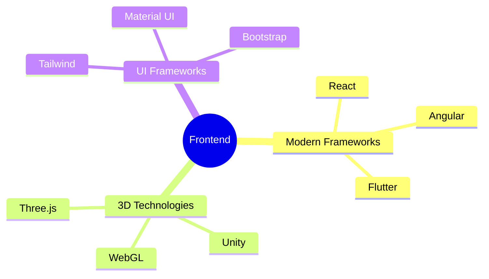
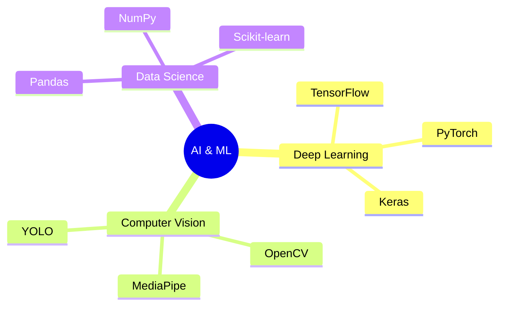
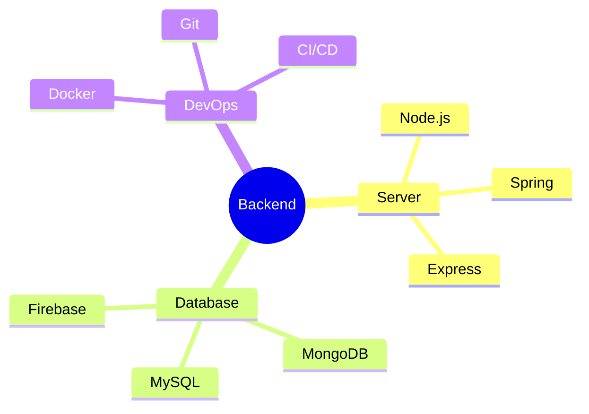

<div align="center">
  
</div>

<p align="center">
  <a href="https://git.io/typing-svg">
    
  </a>
</p>

<div align="center">
  <a href="https://khamessitaha.github.io/">
    
  </a>
  <a href="https://beige-josephine-8.tiiny.site">
    
  </a>
  <a href="mailto:taha.khamessi@gmail.com">
    
  </a>
  
</div>

<div align="center">
  <h2>💻 About Me</h2>
</div>

```typescript
interface Developer {
  name: string;
  role: string;
  location: string;
  expertise: string[];
  techStack: {
    frontend: string[];
    backend: string[];
    ml: string[];
    graphics: string[];
  };
  currentFocus: string;
}

const taha: Developer = {
  name: "Taha Khamessi",
  role: "Full Stack Developer & ML Engineer",
  location: "Tunisia",
  expertise: [
    "Web Development",
    "Machine Learning",
    "3D Graphics",
    "Real-time Systems"
  ],
  techStack: {
    frontend: ["React", "Angular", "Three.js", "WebGL"],
    backend: ["Node.js", "Spring", "MongoDB", "MySQL"],
    ml: ["TensorFlow", "PyTorch", "Scikit-learn", "OpenCV"],
    graphics: ["Three.js", "Unity", "WebGL", "Shader Programming"]
  },
  currentFocus: "Building scalable applications with AI integration"
};
```

<div align="center">
  <h2>🔧 Technical Expertise</h2>
</div>

<details>
<summary>🎨 Frontend Development & 3D Graphics</summary>
<br>
<div align="center">



</div>
</details>

<details>
<summary>🤖 AI & Machine Learning</summary>
<br>
<div align="center">



</div>
</details>

<details>
<summary>⚡ Backend & Infrastructure</summary>
<br>
<div align="center">



</div>
</details>

### 💡 Core Technologies

<div align="center">

| 💻 Development | 🎨 Frontend & 3D | 🤖 AI & ML | ⚡ Backend |
|---------------|-----------------|------------|-----------|
|  |  |  |  |
|  |  |  |  |
|  |  |  |  |

</div>

### 📊 Development Stats

```text
TypeScript   ██████████░░░░░░░░░░░░   40%
Python       ████████░░░░░░░░░░░░░░   30%
JavaScript   ██████░░░░░░░░░░░░░░░░   20%
Other        ██░░░░░░░░░░░░░░░░░░░░   10%
```

<table align="center">
  <tr>
    <td align="center" width="50%">
      
    </td>
    <td align="center" width="50%">
      
    </td>
  </tr>
</table>

### 🚀 Featured Projects

<div align="center">
<table>
  <tr>
    <td width="50%">
      <h3 align="center">Advanced ML Project</h3>
      <div align="center">
        
        <p>
          <a href="https://github.com/username/repo1">
            
          </a>
          <a href="https://project1.demo">
            
          </a>
        </p>
        <p><strong>Stack:</strong> Python, TensorFlow, OpenCV</p>
      </div>
    </td>
    <td width="50%">
      <h3 align="center">3D Web Application</h3>
      <div align="center">
        
        <p>
          <a href="https://github.com/username/repo2">
            
          </a>
          <a href="https://project2.demo">
            
          </a>
        </p>
        <p><strong>Stack:</strong> Three.js, React, WebGL</p>
      </div>
    </td>
  </tr>
</table>
</div>

### 🌐 Connect With Me

<div align="center">
  
  [](https://linkedin.com/in/taha-khamessi-396aba1a3)
  [](https://kaggle.com/tahakhammassi)
  [](https://stackoverflow.com/users/taha-khamessi)
  [](https://discord.gg/YjfDPKrs)
</div>

### 📈 Contribution Graph

<div align="center">
  
</div>

<picture>
  <source media="(prefers-color-scheme: dark)" srcset="https://github.com/KhamessiTaha/KhamessiTaha/blob/output/github-contribution-grid-snake-dark.svg" />
  <source media="(prefers-color-scheme: light)" srcset="https://github.com/KhamessiTaha/KhamessiTaha/blob/output/github-contribution-grid-snake.svg" />
  
</picture>

<div align="center">
  
</div>
