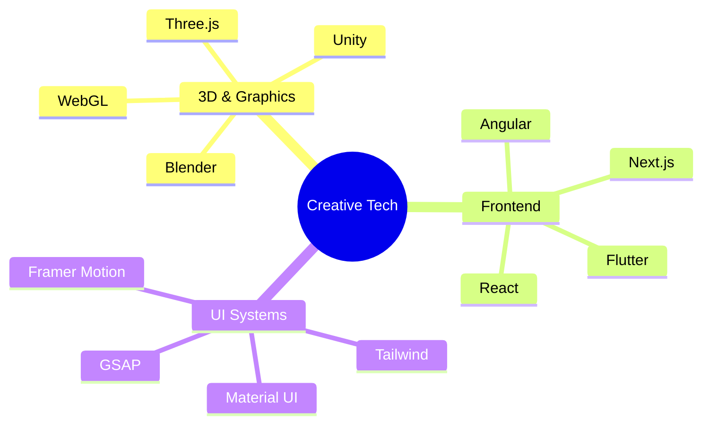
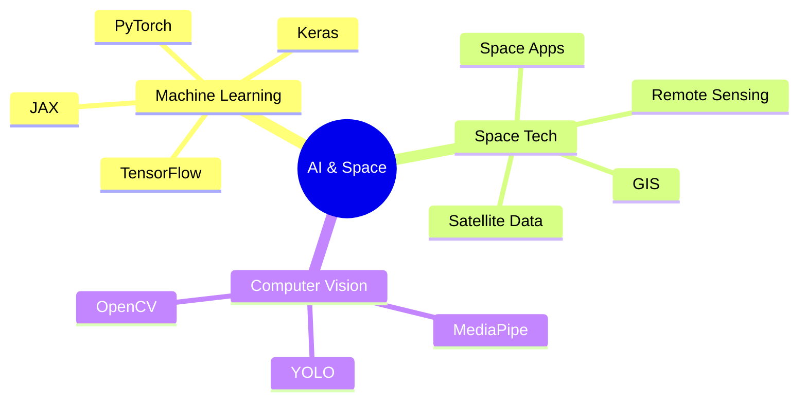
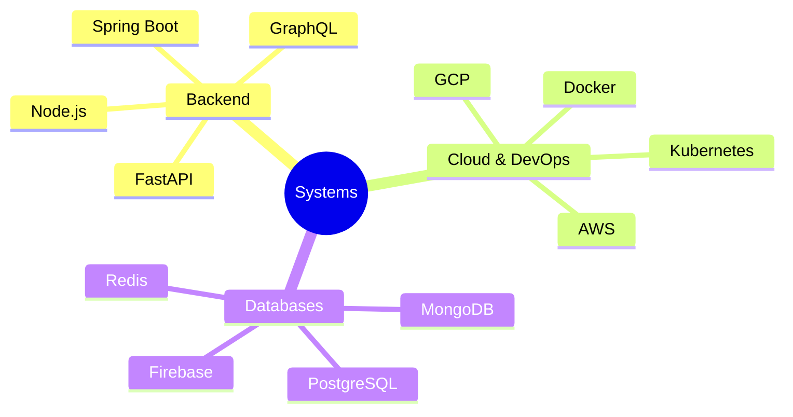
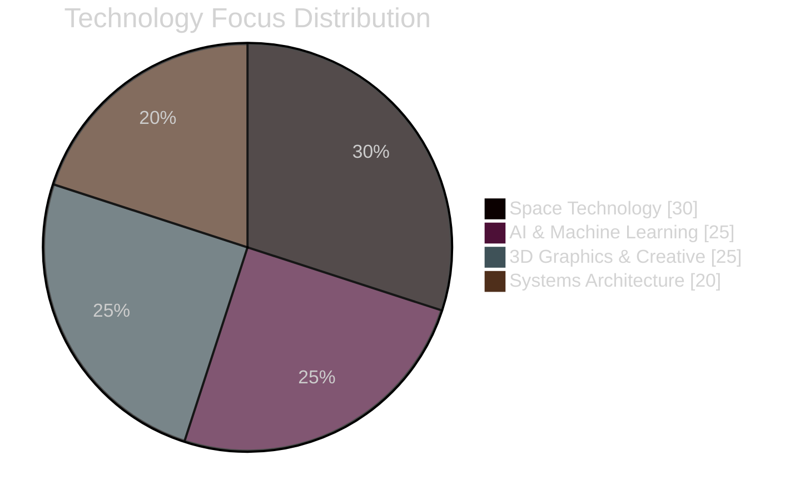

<div align="center">
  
</div>

[](https://git.io/typing-svg)

<div align="center">
  
  [](https://khamessitaha.github.io/)
  [](https://beige-josephine-8.tiiny.site)
  [](mailto:taha.khamessi@gmail.com)
  
  
</div>

<table>
<tr>
<td width="50%">

### 🧑‍🚀 Mission Commander's Log

```javascript
const spaceExplorer = {
  name: "Taha Khamessi",
  role: "Space Technology Engineer",
  location: "Tunisia 🌍",
  mission: {
    current: "NASA Space Apps Challenge 2024",
    status: "In Progress 🟢",
    objective: "Advancing space technology through code"
  },
  skills: {
    spacetech: ["Satellite Data", "Space Apps", "Remote Sensing"],
    development: ["Full Stack", "ML/AI", "3D Graphics"],
    tools: ["TensorFlow", "Three.js", "React", "Python"]
  },
  contact: {
    email: "taha.khamessi@gmail.com",
    availability: "Open to collaboration"
  }
};
```

</td>
<td width="50%">

### 🌌 Cosmic Achievement Metrics


[](https://git.io/streak-stats)

</td>
</tr>
</table>

## 🛸 Technology Command Center

<details>
<summary><b>🎨 Creative Engineering Suite</b></summary>
<br>



</details>

<details>
<summary><b>🤖 AI & Space Technology Lab</b></summary>
<br>



</details>

<details>
<summary><b>⚡ Infrastructure & Systems</b></summary>
<br>



</details>

## 📊 Mission Control Dashboard

<div align="center">



### 🎯 Skill Proficiency Matrix

| Domain | Technologies | Proficiency |
|--------|-------------|-------------|
| **Space Tech** |   | Advanced |
| **3D & Graphics** |   | Expert |
| **Full Stack** |   | Expert |

</div>

## 🚀 Featured Space Missions

<div align="center">
<table>
<tr>
<td width="50%">

<h3 align="center">🛰️ NASA Space Apps Project</h3>


[](https://github.com/username/repo1)
[](https://project1.demo)

**Tech Stack:** TensorFlow, React, Three.js
- 🏆 Global Nominee 2024
- 🌍 Space Technology Innovation
- 🤖 AI-Powered Space Solutions

</td>
<td width="50%">

<h3 align="center">🎮 3D Space Visualization</h3>


[](https://github.com/username/repo2)
[](https://project2.demo)

**Tech Stack:** Three.js, WebGL, React
- 🚀 Real-time 3D Graphics
- 🌌 Space Environment Simulation
- 📊 Interactive Data Visualization

</td>
</tr>
</table>
</div>

## 📈 Contribution Constellation

<div align="center">
  
</div>

<div align="center">

## 🌐 Connect Across the Universe

[](https://linkedin.com/in/taha-khamessi-396aba1a3)
[](https://kaggle.com/tahakhammassi)
[](https://stackoverflow.com/users/taha-khamessi)
[](https://discord.gg/YjfDPKrs)

### 🌟 Visitor Counter


</div>

<picture>
  <source media="(prefers-color-scheme: dark)" srcset="https://github.com/KhamessiTaha/KhamessiTaha/blob/output/github-contribution-grid-snake-dark.svg" />
  <source media="(prefers-color-scheme: light)" srcset="https://github.com/KhamessiTaha/KhamessiTaha/blob/output/github-contribution-grid-snake.svg" />
  
</picture>

<div align="center">
  
</div>
