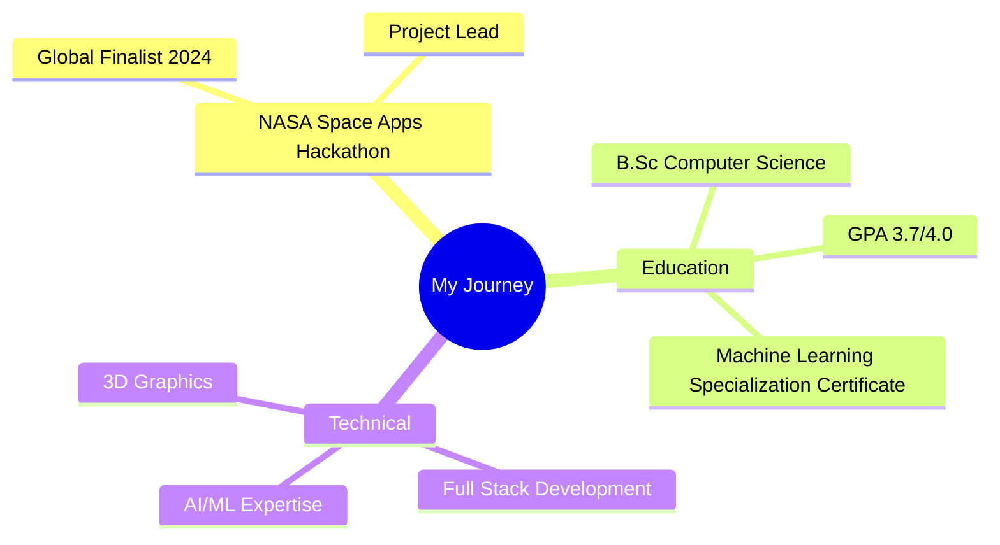

# Taha Khamessi | Full Stack Developer | AI Specialist 🚀      


<div align="center">
  
[](https://git.io/typing-svg)


[](https://linkedin.com/in/taha-khamessi-396aba1a3)
[](https://khamessitaha.github.io/)
[](mailto:taha.khamessi@gmail.com)


</div>

## 📊 GitHub Analytics


<div align="center">
  


<table>
  <tr>
    <td></td>
    <td></td>
    
  </tr>
  <tr align="center">
    <td class='center'></td>
    <td></td>
  </tr>  
</table>


</div>

## 👨‍💻 About Me 

> 🌟 Transforming ideas into code, one commit at a time.

```javascript
const taha = {
    role: "Full Stack Developer | AI Specialist",
    motto: "Building the future, one line of code at a time 🚀",
    code: ["JavaScript", "Python", "Java"],
    technologies: {
        frontend: ["React", "NextJS", "Angular", "Tailwind", "Bootstrap", "Three.js"],
        backend: ["Node","Nestjs" , "Expressjs", "Spring"],
        ai_ml: ["TensorFlow", "Keras", "Scikit learn", "OpenCV"],
        devOps: ["Docker", "CI/CD", "Firebase"],
        databases: ["MongoDB", "MySQL", "Firestore","PostgreSQL"],
    },
    interests: ["web dev", "space tech", "AI/ML", "philosophy"],
    funFact: "There are two ways to write error-free programs; only the third one works"
};
```

## 🏆 Achievements & Recognition

<div align="center">



</div>

## 💻 Tech Stack & Tools

<div align="center">

### 🛠 Languages


### 🌐 Web Development


### 🤖 AI & Machine Learning Realms


</div>

---

<div align="center">

📝 *Created with ❤️ by Taha Khamessi*
</div>
