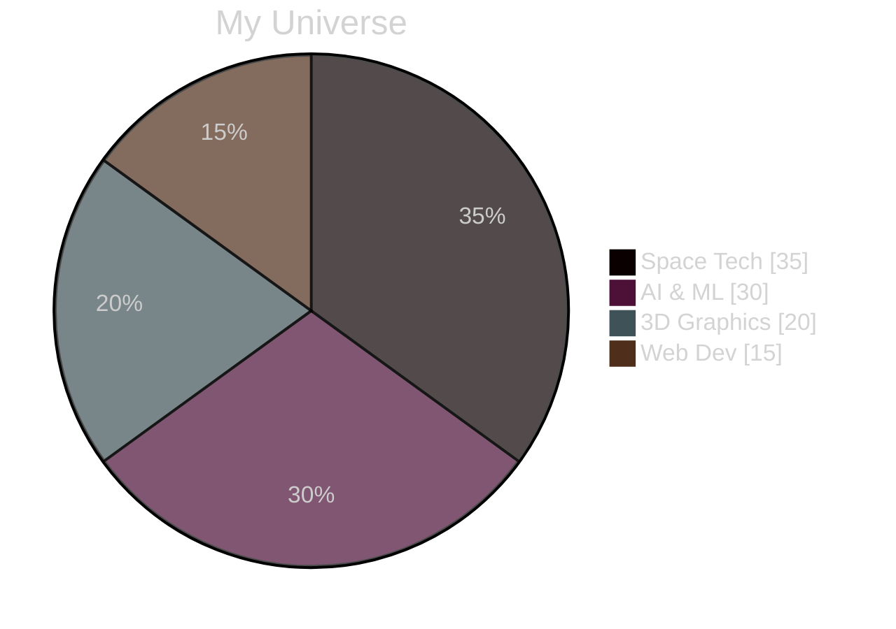

<div align="center">
  
</div>

<div align="center">
  
[](https://git.io/typing-svg)

</div>


### 🚀 Quick Launch

```javascript
const taha = {
    passion: "Space Technology & AI",
    code: ["Python", "JavaScript", "TypeScript"],
    askMeAbout: ["space tech", "web dev", "AI/ML", "3D graphics"],
    current: "NASA Space Apps Challenge 2024",
    funFact: "I don't trust people who don't use dark mode 🌙"
};
```

<div align="center">
  <a href="https://khamessitaha.github.io/">
    
  </a>
  <a href="mailto:taha.khamessi@gmail.com">
    
  </a>
  <a href="https://linkedin.com/in/taha-khamessi-396aba1a3">
    
  </a>
</div>

---

### 🌟 Cosmic Powers (Skills)

<div align="center">




</div>

### ⚡ Recent Space Missions

<div align="center">
<table>
<tr>
<td width="50%">
<h3 align="center">🛸 Space Project One</h3>

<p align="center">
  <a href="https://github.com/username/repo1" target="_blank">
    
  </a>
  <a href="#" target="_blank">
    
  </a>
</p>
</td>
<td width="50%">
<h3 align="center">🌌 Space Project Two</h3>

<p align="center">
  <a href="https://github.com/username/repo2" target="_blank">
    
  </a>
  <a href="#" target="_blank">
    
  </a>
</p>
</td>
</tr>
</table>
</div>

### 📊 Mission Statistics

<div align="center">
  
  
</div>

<div align="center">
  
</div>

<div align="center">

### 🎵 Currently Vibing To
[](https://open.spotify.com/user/USER_ID)

### 🌍 Visitor Count


</div>

<div align="center">
  
</div>

<div align="center">
  
</div>
