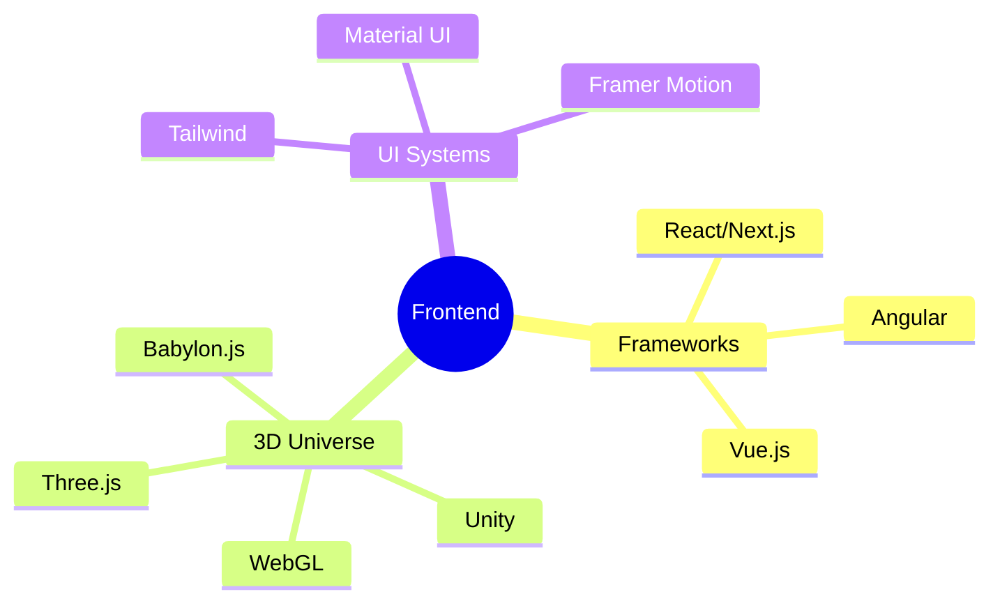
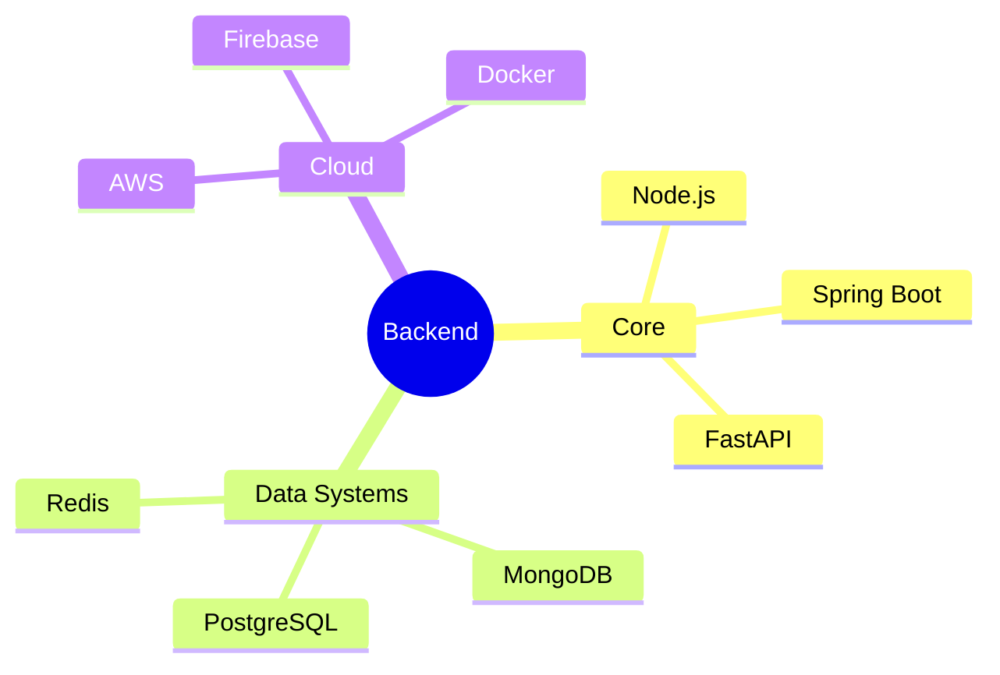
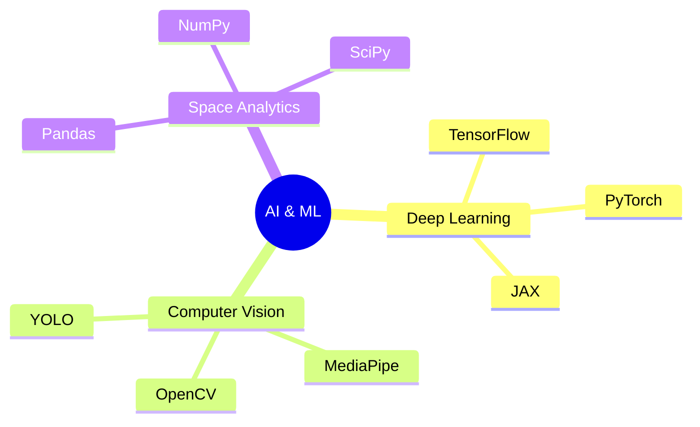
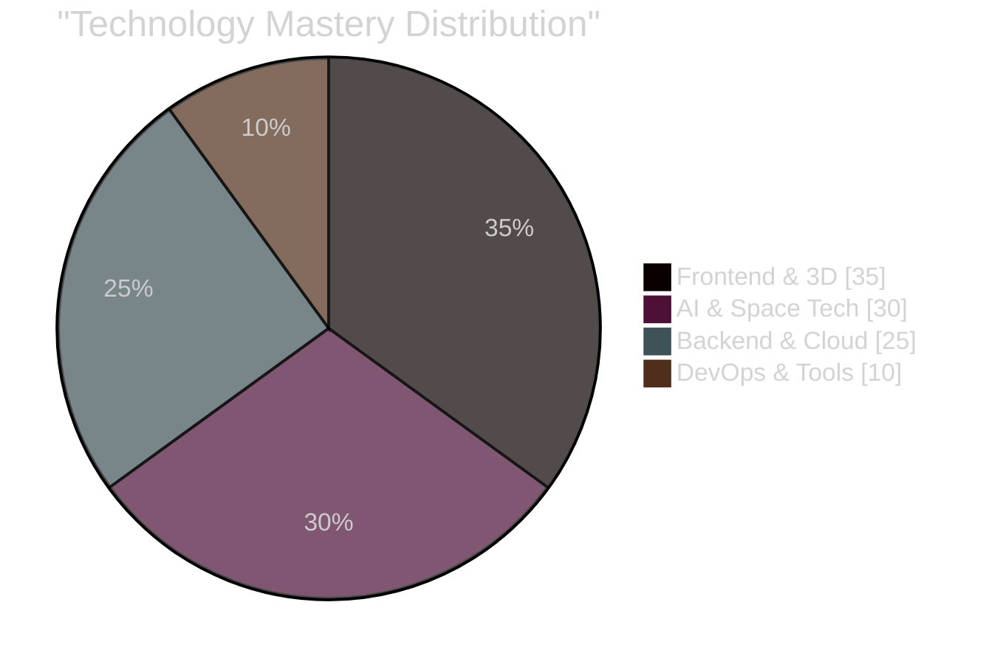

<div align="center">
  
</div>

<div align="center">
  
  [](https://git.io/typing-svg)
  
  <a href="https://khamessitaha.github.io/">
    
  </a>
  <a href="https://beige-josephine-8.tiiny.site">
    
  </a>
  <a href="mailto:taha.khamessi@gmail.com">
    
  </a>
  
</div>

<br>

<table align="center">
<tr>
<td width="58%">

## 🧑‍🚀 Mission Commander Log

```typescript
interface SpaceExplorer {
  name: string;
  role: string;
  location: string;
  missions: string[];
  skills: string[];
  favoriteQuote: string;
}

const taha: SpaceExplorer = {
  name: "Taha Khamessi",
  role: "Full Stack Space Pioneer",
  location: "Tunisia 🌍",
  missions: [
    "NASA Space Apps Challenge 2024",
    "AI-Powered Space Analytics",
    "3D Universe Simulation",
    "Real-time Space Data Processing"
  ],
  skills: [
    "Full Stack Development",
    "Machine Learning",
    "3D Graphics",
    "Space Technology",
    "Real-time Systems"
  ],
  favoriteQuote: `"The universe is not outside of you. 
    Look inside yourself; 
    everything that you want, 
    you already are." 
    - Rumi`
};
```

</td>
<td width="42%">
  
  
  <div align="center">
    <h3>🌌 Current Space-Time Coordinates</h3>
    <a href="https://linkedin.com/in/taha-khamessi-396aba1a3">
      
    </a>
    <a href="https://kaggle.com/tahakhammassi">
      
    </a>
    <a href="https://discord.gg/YjfDPKrs">
      
    </a>
  </div>
</td>
</tr>
</table>

<div align="center">
  <h2>🛸 Technology Arsenal & Space Equipment</h2>
</div>

<table align="center">
<tr>
<td width="50%">

<h3 align="center">Frontend Constellation 🎨</h3>



</td>
<td width="50%">

<h3 align="center">Backend Nebula ⚡</h3>



</td>
</tr>
<tr>
<td colspan="2">

<h3 align="center">AI & ML Laboratory 🧠</h3>



</td>
</tr>
</table>

<div align="center">
  <h2>🌠 Mission Statistics</h2>
</div>

<table align="center">
<tr>
<td width="50%">


</td>
<td width="50%">


</td>
</tr>
</table>

<div align="center">
  
</div>

### 🎯 Skill Constellations

<div align="center">



| 💻 Core Systems | 🎨 Creative Tech | 🤖 AI & ML | ⚡ Infrastructure |
|----------------|------------------|------------|------------------|
|  |  |  |  |
|  |  |  |  |

</div>

### 📊 Cosmic Activity

```typescript
// Weekly Development Analysis
const weeklyStats = {
  JavaScript:   "█████████████           45.2%",
  Python:       "████████░░░░░░░░░░░░░   25.8%",
  TypeScript:   "██████░░░░░░░░░░░░░░░   15.3%",
  "HTML/CSS":   "████░░░░░░░░░░░░░░░░░   10.2%",
  Other:        "██░░░░░░░░░░░░░░░░░░░   3.5%"
};
```

### 🚀 Featured Space Missions

<div align="center">
<table>
<tr>
<td width="50%">
<h3 align="center">🌌 Project Nova</h3>

<div align="center">

[](https://github.com/username/repo1)
[](https://project1.demo)

**Tech Stack:** React, Three.js, TensorFlow
</div>
</td>
<td width="50%">
<h3 align="center">🛸 Project Quantum</h3>

<div align="center">

[](https://github.com/username/repo2)
[](https://project2.demo)

**Tech Stack:** PyTorch, FastAPI, WebGL
</div>
</td>
</tr>
</table>
</div>

### 📈 Contribution Constellation
<div align="center">
  
</div>

<div align="center">
  <h2>🌌 Quantum Entanglement Trail</h2>
  <picture>
    <source media="(prefers-color-scheme: dark)" srcset="https://github.com/KhamessiTaha/KhamessiTaha/blob/output/github-contribution-grid-snake-dark.svg" />
    <source media="(prefers-color-scheme: light)" srcset="https://github.com/KhamessiTaha/KhamessiTaha/blob/output/github-contribution-grid-snake.svg" />
    
  </picture>
</div>

<div align="center">
  
</div>
