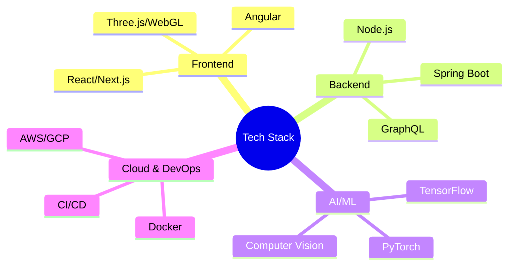

<div align="center">
  
</div>

<div align="center">
  <a href="https://git.io/typing-svg">
    
  </a>
</div>

<div align="center">
  <a href="https://khamessitaha.github.io/" target="_blank">
    
  </a>
  <a href="https://linkedin.com/in/taha-khamessi-396aba1a3" target="_blank">
    
  </a>
  <a href="mailto:taha.khamessi@gmail.com">
    
  </a>
  <a href="https://beige-josephine-8.tiiny.site" target="_blank">
    
  </a>
</div>

<br>

## 🧑‍🚀 Mission Control Center

```typescript
class SpaceExplorer {
  private static instance: SpaceExplorer;
  
  private constructor(
    private readonly profile: {
      name: string;
      role: string;
      location: string;
      mission: string;
      expertise: string[];
      contact: string;
    }
  ) {}

  public static getInstance(): SpaceExplorer {
    if (!SpaceExplorer.instance) {
      SpaceExplorer.instance = new SpaceExplorer({
        name: "Taha Khamessi",
        role: "Space Technology Engineer & Full Stack Developer",
        location: "Tunisia 🌍",
        mission: "Bridging the gap between space technology and software innovation",
        expertise: [
          "Space Systems Engineering",
          "Full Stack Development",
          "AI/ML Solutions",
          "3D Graphics & Simulation",
          "Real-time Systems"
        ],
        contact: "taha.khamessi@gmail.com"
      });
    }
    return SpaceExplorer.instance;
  }

  public getMissionStatement(): string {
    return "Creating technology that brings space exploration closer to Earth 🌠";
  }
}
```

## 🛸 Technology Arsenal

<details>
<summary><b>🌌 Space Technology & Engineering</b></summary>
<br>

- **Simulation & Modeling**
  - Orbital Mechanics
  - Space Systems Design
  - Mission Planning Tools
  
- **Data Processing**
  - Satellite Data Analysis
  - Remote Sensing
  - Ground Station Operations
  
- **Space Applications**
  - NASA EOSDIS
  - ESA Earth Observation
  - Space Apps Challenge Tools
</details>

<details>
<summary><b>💻 Development Stack</b></summary>
<br>


</details>

## 📊 Mission Statistics

<div align="center">
  
  
</div>

## 🚀 Featured Space Missions (Projects)

<div align="center">
<table>
  <tr>
    <td width="50%">
      <h3 align="center">Space Data Visualization Platform</h3>
      <div align="center">
        
        <p>
          <a href="#">
            
          </a>
        </p>
        <p>Interactive platform for visualizing space data using Three.js and NASA's APIs</p>
      </div>
    </td>
    <td width="50%">
      <h3 align="center">Satellite Tracking AI</h3>
      <div align="center">
        
        <p>
          <a href="#">
            
          </a>
        </p>
        <p>ML-powered system for tracking and predicting satellite trajectories</p>
      </div>
    </td>
  </tr>
</table>
</div>

## 📈 Contribution Metrics

<div align="center">
  
</div>

## 🎯 Current Missions

- 🚀 Leading the 2024 NASA Space Apps Challenge
- 🛸 Developing space data visualization tools
- 🌠 Creating AI solutions for space applications
- 🌍 Contributing to open-source space tech projects

## 🌌 Connect Across the Cosmos

<div align="center">
  <a href="https://kaggle.com/tahakhammassi">
    
  </a>
  <a href="https://stackoverflow.com/users/taha-khamessi">
    
  </a>
  <a href="https://discord.gg/YjfDPKrs">
    
  </a>
</div>

<div align="center">
  
</div>
