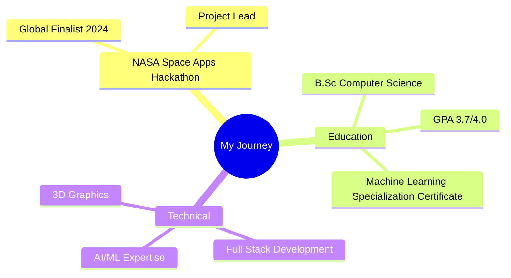

# Taha Khamessi | Full Stack Developer 🚀

<div align="center">
  
[](https://git.io/typing-svg)

[](https://linkedin.com/in/taha-khamessi-396aba1a3)
[](https://khamessitaha.github.io/)
[](mailto:taha.khamessi@gmail.com)


</div>

## 📊 GitHub Analytics

<div align="center">
  


<table>
  <tr>
    <td></td>
    <td></td>
    
  </tr>
  <tr>
    <td class='center'></td>
    <td></td>
  </tr>  
</table>


</div>

## 👨‍💻 About Me 

> 🌟 Transforming ideas into code, one commit at a time.

```javascript
const taha = {
    role: "Full Stack Developer",
    motto: "Building the future, one line of code at a time 🚀",
    code: ["JavaScript", "Python", "Java"],
    askMeAbout: ["web dev", "space tech", "AI/ML", "philosophy"],
    technologies: {
        frontend: {
            js: ["React", "Angular"],
            css: ["Tailwind", "Bootstrap"],
            graphics: ["Three.js"]
        },
        backend: {
            js: ["Node", "Express"],
            java: ["Spring"],
            python: ["Django"]
        },
        ai_ml: ["TensorFlow", "PyTorch", "OpenCV"],
        devOps: ["Docker", "CI/CD", "Firebase"],
        databases: ["MongoDB", "MySQL", "Firestore"],
        misc: ["GraphQL", "Socket.IO"]
    },
    funFact: "There are two ways to write error-free programs; only the third one works"
};
```

## 🏆 Achievements & Recognition

<div align="center">



</div>

## 🎯 Current Focus


## 🎨 Featured Projects

### 🌌 CosmicVue - Interactive Solar System
<div align="center">
  
  
  
</div>

[](https://cosmicvue.netlify.app/)
[](https://github.com/khamessitaha/CosmoArchitects)

<details>
<summary>🔍 Project Details</summary>

- 🌟 Real-time planetary motion simulation with accurate orbital mechanics
- 🎮 Interactive camera controls with zoom, pan, and orbit functionality
- 📊 Dynamic data visualization of planetary statistics
- 🏆 Global Finalist - NASA Space Apps Challenge 2024
- 🔧 Custom shaders for realistic planet rendering
</details>

### 🚗 CarVision - AI Vehicle Recognition
<div align="center">
  
  
  
</div>

[](https://github.com/khamessitaha/CarVisionProject)

<details>
<summary>🔍 Project Details</summary>

- 🤖 Custom-trained AI model for vehicle recognition
- 💰 Price prediction algorithm using historical data
- 📱 Cross-platform mobile application
- ⚡ Real-time processing and analysis
- 🔄 Continuous model improvement through user feedback
</details>

## 💻 Tech Stack & Tools

<div align="center">

### 🔧 Languages & Frameworks


### 🎨 Frontend


### ⚙️ Backend & DevOps


</div>

---

<div align="center">

### 💭 Random Dev Quote


### 👾 Fun Fact
*"There are 10 types of people in the world. Those who understand binary and those who don't."*

📝 *Created with ❤️ by Taha Khamessi*
</div>
