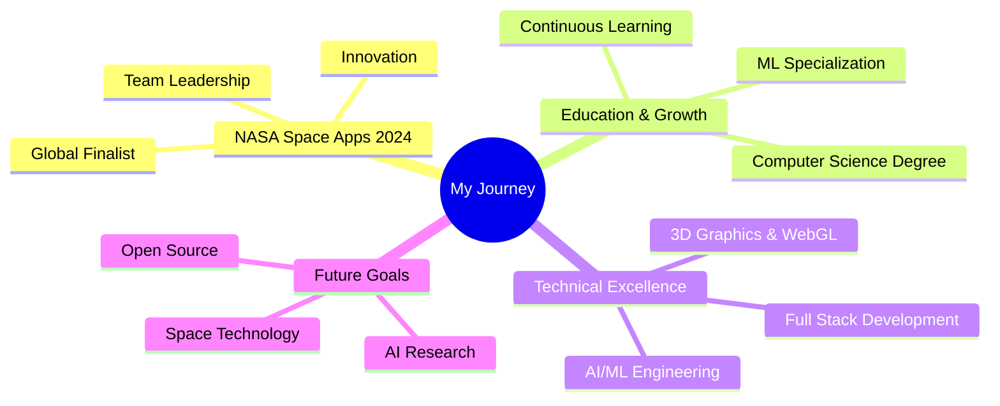

# Hi there, I'm Taha Khamessi! 👋

<div align="center">
  
[](https://git.io/typing-svg)

</div>

---

## 🚀 About Me

```javascript
const taha = {
  title: "Full Stack Developer & AI Specialist",
  location: "Tunisia 🇹🇳",
  currentFocus: "Building AI-powered applications",
  motto: "Transforming ideas into reality through code ✨",
  
  code: {
    languages: ["JavaScript", "Python", "Java", "TypeScript", "Dart"],
    frontend: ["React", "Next.js", "Angular", "Vue.js", "Three.js"],
    backend: ["Node.js", "NestJS", "Express", "Spring Boot", "FastAPI"],
    ai_ml: ["TensorFlow", "PyTorch", "Scikit-learn", "OpenCV", "Keras"],
    mobile: ["Flutter", "React Native"],
    databases: ["MongoDB", "PostgreSQL", "MySQL", "Redis", "Firestore"],
    devOps: ["Docker", "Kubernetes", "CI/CD", "AWS", "Firebase"],
    tools: ["Git", "Postman", "Figma", "VS Code", "Jupyter"]
  },
  
  interests: [
    "🌌 Space Technology & Exploration",
    "🤖 Artificial Intelligence & Machine Learning",
    "🎨 3D Graphics & WebGL",
    "📚 Philosophy & Critical Thinking",
    "🚀 Emerging Technologies"
  ],
  
  funFact: "I believe the best code is the one that solves real problems! 💡"
};
```

## 🏆 Achievements & Recognition

<div align="center">

| 🎯 Achievement | 📅 Year | 🏅 Status |
|:---|:---:|:---:|
| **NASA Space Apps Hackathon** | 2024 | 🥇 Global Finalist |
| **B.Sc Computer Science** | 2024 | 🎓 GPA: 3.7/4.0 |
| **Machine Learning Specialization** | 2023 | ✅ Certified |
| **Project Leadership** | Ongoing | 👥 Team Lead |

</div>

## 💻 Tech Stack

<div align="center">

### 🛠 Programming Languages


### 🌐 Frontend Development


### ⚙️ Backend Development


### 🤖 AI & Machine Learning


### 🗄️ Databases


### ☁️ DevOps & Cloud


</div>

## 📊 GitHub Analytics

<div align="center">


</div>

<div align="center">


</div>

### 🐍 Contribution Graph


## 🎯 Current Focus



## 🌟 Featured Projects

<div align="center">

| 🚀 Project | 💻 Tech Stack | 🔗 Links |
|:---:|:---:|:---:|
| **Space Exploration Platform** | React, Three.js, Node.js | [🔗 Demo](https://khamessitaha.github.io/) |
| **AI-Powered Web App** | Python, TensorFlow, FastAPI | [📱 Live](https://khamessitaha.github.io/) |
| **3D Interactive Experience** | Three.js, WebGL, React | [✨ View](https://khamessitaha.github.io/) |

</div>

## 🤝 Let's Connect!

<div align="center">

[](https://linkedin.com/in/taha-khamessi-396aba1a3)
[](https://khamessitaha.github.io/)
[](mailto:taha.khamessi@gmail.com)
[](https://github.com/KhamessiTaha)

</div>

## 💬 Quote

<div align="center">

> *"The best way to predict the future is to create it."* - Peter Drucker

**Always open to collaborate on innovative projects and ideas! 🚀**

</div>

---

<div align="center">
  
**Thanks for visiting my profile! 🙏**


[](https://github.com/KhamessiTaha)

*⭐ Star my repositories if you find them interesting!*

</div>
