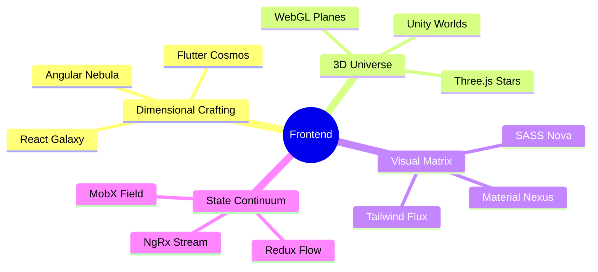
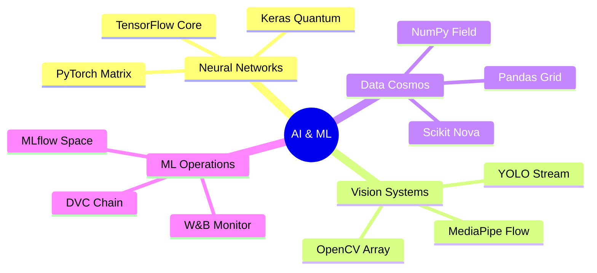

<div align="center">
  
</div>

<div align="center">
  
</div>

<div align="center">
  <a href="https://khamessitaha.github.io/">
    
  </a>
  <a href="https://beige-josephine-8.tiiny.site">
    
  </a>
  <a href="mailto:taha.khamessi@gmail.com">
    
  </a>
  
</div>

<br>

<div align="center">
  
</div>

```typescript
interface CosmicExplorer {
  name: string;
  title: string;
  coordinates: string;
  status: "exploring" | "building" | "innovating";
  specializations: string[];
  currentMission: string;
  communicationBeacon: string;
}

const taha: CosmicExplorer = {
  name: "Taha Khamessi",
  title: "Intergalactic Software Engineer",
  coordinates: "Tunisia Sector, Milky Way 🌌",
  status: "exploring",
  specializations: [
    "Space Technology & Analytics",
    "AI/ML Engineering",
    "Full Stack Development",
    "3D Universe Creation",
    "Real-time Systems Architecture"
  ],
  currentMission: "Leading NASA Space Apps Challenge",
  communicationBeacon: "taha.khamessi@gmail.com"
};

class SpacePhilosophy {
  static readonly manifesto: string = 
    "In the vastness of code, we are all explorers. " +
    "Every commit is a step into the unknown, " +
    "every deployment a new constellation.";
}
```

<div align="center">
  <h2>🌠 Stellar Achievements</h2>
</div>

<table align="center">
  <tr>
    <td align="center" width="50%">
      
    </td>
    <td align="center" width="50%">
      
    </td>
  </tr>
</table>

<div align="center">
  <h2>🛸 Technology Arsenal</h2>
</div>

<details>
<summary>🎨 Holographic Interface Engineering</summary>
<br>
<div align="center">



</div>
</details>

<details>
<summary>🧠 Quantum Computing Lab</summary>
<br>
<div align="center">



</div>
</details>

### 📊 Space-Time Allocation

```text
▰▰▰▰▰▰▰▰▰▱ JavaScript   45.2%
▰▰▰▰▰▱▱▱▱▱ Python       25.8%
▰▰▰▱▱▱▱▱▱▱ TypeScript   15.3%
▰▰▱▱▱▱▱▱▱▱ HTML/CSS     10.2%
▰▱▱▱▱▱▱▱▱▱ Other        3.5%
```

<div align="center">
  <h2>🌌 Recent Space Expeditions</h2>
</div>

<div align="center">
<table>
  <tr>
    <td width="50%">
      <h3 align="center">🚀 Project Nebula</h3>
      <div align="center">
        
        <p>
          <a href="https://github.com/username/repo1">
            
          </a>
          <a href="https://project1.demo">
            
          </a>
        </p>
      </div>
    </td>
    <td width="50%">
      <h3 align="center">💫 Project Quantum</h3>
      <div align="center">
        
        <p>
          <a href="https://github.com/username/repo2">
            
          </a>
          <a href="https://project2.demo">
            
          </a>
        </p>
      </div>
    </td>
  </tr>
</table>
</div>

### 🌠 Contribution Constellation

<div align="center">
  
</div>

<div align="center">
  <h2>🌌 Quantum Entanglements</h2>
  
  [](https://linkedin.com/in/taha-khamessi-396aba1a3)
  [](https://kaggle.com/tahakhammassi)
  [](https://stackoverflow.com/users/taha-khamessi)
  [](https://discord.gg/YjfDPKrs)
</div>

<div align="center">
  
</div>
