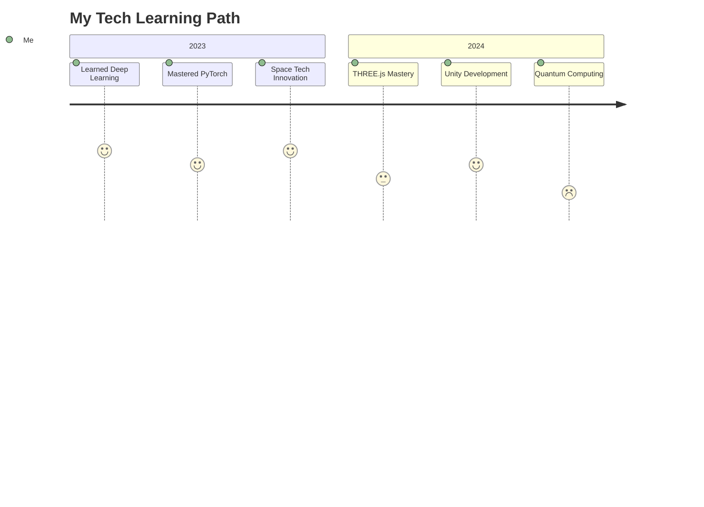

<div align="center">
  
  <!-- Dynamic 3D Header -->
  [](https://tahakhamessi.my.canva.site/)
  
  <!-- 3D Text Banner -->
  <a href="https://git.io/typing-svg">
    
  </a>

  <!-- Animated Badge Collection -->
  <p>
    
    
    
  </p>

  <!-- Dynamic Island Stats -->
  

</div>

<!-- Animated Introduction Section -->
## 🌌 Welcome to My Universe!

```python
class TahaKhamessi:
    def __init__(self):
        self.name = "Taha Khamessi"
        self.role = "Software Developer & Deep Learning Enthusiast"
        self.location = "🌍 Tunisia"
        self.current_project = "2024 NASA International Space Apps Challenge 🛸"
        self.knowledge_base = ["Deep Learning", "Space Tech", "Full-Stack Dev"]
        self.interests = ["Quantum Computing", "Astronomy", "AI Ethics"]
        
    def say_hi(self):
        print("Thanks for dropping by! Let's create something amazing together! 🚀")
    
    def get_skills(self):
        return {
            "AI & ML": ["TensorFlow", "PyTorch", "Scikit-learn", "Computer Vision"],
            "Web Dev": ["React", "Angular", "Node.js", "THREE.js"],
            "DevOps": ["Docker", "Kubernetes", "CI/CD"],
            "Languages": ["Python", "JavaScript", "TypeScript", "Java", "C++"]
        }
        
    def daily_routine(self):
        return ["☕ Coffee", "💻 Code", "🧠 Learn", "🔄 Repeat"]
```

<!-- Animated Skill Bars -->
## 🎯 Skill Arsenal
```
AI/ML           ███████████████████░░   95%
Space Tech      ██████████████████░░░   90%
Full-Stack Dev  ███████████████████░░   95%
Problem Solving ██████████████████░░░   90%
Innovation      ███████████████████░░   95%
```

<!-- Interactive Project Section -->
## 🚀 Featured Projects

<table>
  <tr>
    <td width="50%">
      <h3 align="center">Deep Space Navigator 🛸</h3>
      <div align="center">
        <a href="https://github.com/username/project" target="_blank">
          
        </a>
        <p><strong>AI-Powered Space Navigation System</strong></p>
      </div>
    </td>
    <td width="50%">
      <h3 align="center">Neural Explorer 🧠</h3>
      <div align="center">
        <a href="https://github.com/username/project" target="_blank">
          
        </a>
        <p><strong>Advanced Neural Network Visualization</strong></p>
      </div>
    </td>
  </tr>
</table>

<!-- Tech Stack Visualizer -->
## 🛠️ Tech Multiverse

<div align="center">
  
</div>

<!-- Animated Stats Section -->
## 📊 GitHub Chronicles
<div align="center">
  
  
</div>

<!-- Interactive Learning Journey -->
## 🎓 Learning Journey


<!-- Fun Interaction Section -->
## 🎮 Let's Have Some Fun!

<details>
<summary>🎲 Roll a Dice</summary>

</details>

<details>
<summary>🎯 Daily Coding Quote</summary>
<br>
<i>"The best error message is the one that never shows up."</i> - Thomas Fuchs
</details>

<details>
<summary>🌌 Space Fact of the Day</summary>
<br>
<i>One day on Venus is longer than one year on Venus! Venus takes 243 Earth days to rotate on its axis but only 225 Earth days to orbit the Sun.</i>
</details>

<!-- Music & Vibes Section -->
## 🎵 Current Vibes
<div align="center">
  
  [](https://open.spotify.com/user/31nqkd4reaju3zrfpwqbvnnloupi)
  
  <!-- Custom Music Waves -->
  
</div>

<!-- Interactive Connect Section -->
## 🤝 Let's Connect & Create!
<div align="center">
  <a href="https://linkedin.com/in/taha-khamessi-396aba1a3">
    
  </a>
  <a href="https://kaggle.com/tahakhammassi">
    
  </a>
  <a href="mailto:taha.khamessi@gmail.com">
    
  </a>
  <a href="https://discord.gg/YjfDPKrs">
    
  </a>
</div>

<!-- Dynamic Activity Snake -->
## 🐍 Contribution Constellation
<div align="center">
  
</div>

<!-- Interactive Footer -->
<div align="center">
  
</div>

<!-- Secret Easter Egg -->
<details>
<summary>🎁 You've Found a Secret!</summary>
<br>
<div align="center">
  
  <p>Congratulations! You're officially awesome! 🎉</p>
</div>
</details>
