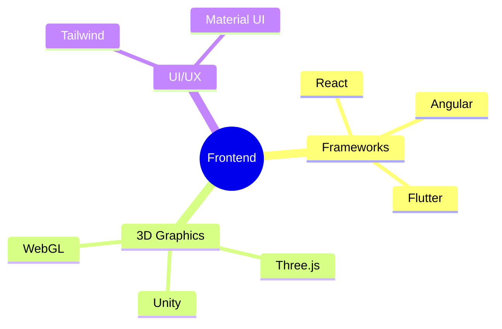
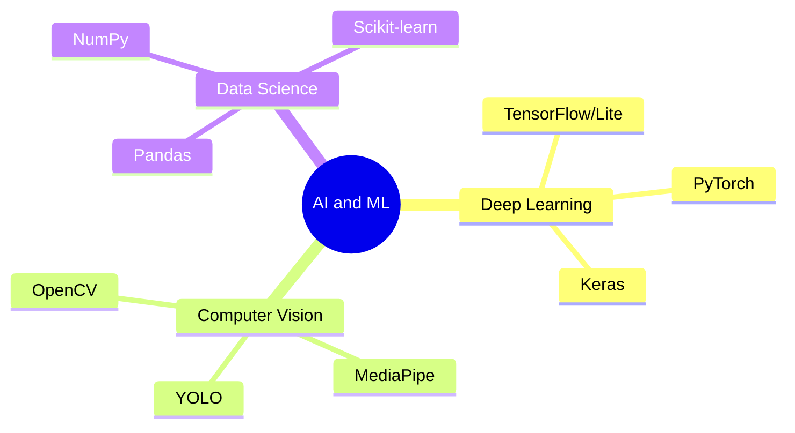
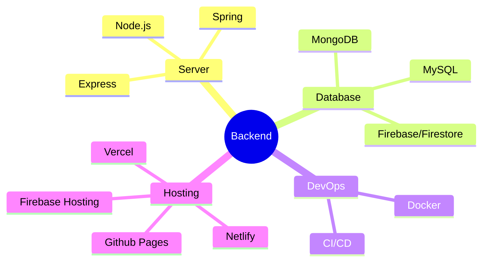

<div align="center">
  
</div>

<p align="center">
  <a href="https://git.io/typing-svg">
    
  </a>
</p>

<div align="center">
  <a href="https://khamessitaha.github.io/">
    
  </a>
  <a href="https://beige-josephine-8.tiiny.site">
    
  </a>
  <a href="mailto:taha.khamessi@gmail.com">
    
  </a>
  
</div>

<div align="center">
  <h2>🌌 About The Explorer 🚀</h2>
  
</div>

```javascript
const taha = {
  name: "Taha Khamessi",
  title: "Full Stack Developer & ML Enthusiast",
  location: "Tunisia 🌍",
  available: true,
  skills: [
    "Space Technology",
    "Full Stack Development",
    "Machine Learning",
    "3D Graphics",
    "Real-time Systems"
  ],
  currentProject: "2024 NASA Space Apps Challenge",
  contact: "taha.khamessi@gmail.com"
};

class Philosophy {
  static get quote() {
    return "I don't hold the planets and stars " +
           "responsible for my choices.";
  }
}
```

<div align="center">
  <h2>🎯 Mission Objectives</h2>
</div>
<table align="center">
  <tr>
    <td align="center" width="50%">
      
    </td>
    <td align="center" width="50%">
      
    </td>
  </tr>
</table>

<div align="center">
  <h2>🛠️ Technology Arsenal</h2>
</div>

<details>
<summary>🎨 Frontend & Creative Development</summary>
<br>
<div align="center">

</div>
</details>

<details>
<summary>🧠 AI & Machine Learning Laboratory</summary>
<br>
<div align="center">

</div>
</details>

<details>
<summary>⚡ Backend & Infrastructure Command Center</summary>
<br>
<div align="center">

</div>
</details>

<div align="center">
  <h2>📊 Mission Statistics</h2>
  
</div>
<div align="center">
  <h2>🌐 Quantum Entanglements (Social Links)</h2>
  
  [](https://linkedin.com/in/taha-khamessi-396aba1a3)
  [](https://kaggle.com/tahakhammassi)
  [](https://stackoverflow.com/users/taha-khamessi)
  [](https://discord.gg/YjfDPKrs)
</div>
### 🎯 Skills & Expertise

<div align="center">

| 💻 Programming  | 🎨 Frontend & 3D | 🤖 AI & ML | ⚙️ Backend & DevOps |
|----------------|-----------------|------------|-------------------|
|  |  |  |  |
|  |  |  |  |
|  |  |  |  |
|  |  |  |  |
</div>

### 📊 Weekly Development Breakdown
```text
JavaScript   █████████████           45.2%
Python       ████████░░░░░░░░░░░░░   25.8%
TypeScript   ██████░░░░░░░░░░░░░░░   15.3%
HTML/CSS     ████░░░░░░░░░░░░░░░░░   10.2%
Other        ██░░░░░░░░░░░░░░░░░░░   3.5%
```
### 🌌 Recent Space Missions (Projects)
<div align="center">
<table>
  <tr>
    <td width="50%">
      <h3 align="center">Project 1</h3>
      <div align="center">
        
        <p>
          <a href="https://github.com/username/repo1">
            
          </a>
          <a href="https://project1.demo">
            
          </a>
        </p>
        <p><strong>Technologies Used:</strong> React, Node.js, MongoDB</p>
      </div>
    </td>
    <td width="50%">
      <h3 align="center">Project 2</h3>
      <div align="center">
        
        <p>
          <a href="https://github.com/username/repo2">
            
          </a>
          <a href="https://project2.demo">
            
          </a>
        </p>
        <p><strong>Technologies Used:</strong> Three.js, WebGL, TensorFlow</p>
      </div>
    </td>
  </tr>
</table>
</div>

### 📈 Contribution Constellation
<div align="center">
  
</div>

### 🐍 Contribution Snake
<picture>
  <source media="(prefers-color-scheme: dark)" srcset="https://github.com/KhamessiTaha/KhamessiTaha/blob/output/github-contribution-grid-snake-dark.svg" />
  <source media="(prefers-color-scheme: light)" srcset="https://github.com/KhamessiTaha/KhamessiTaha/blob/output/github-contribution-grid-snake.svg" />
  
</picture>
<div align="center">
  
</div>

